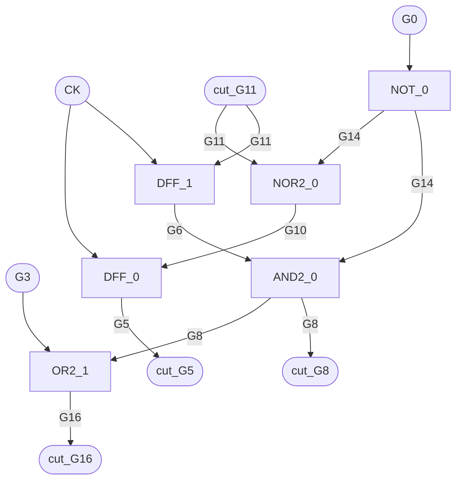

# s27 Partition A Circuit Diagram

```mermaid
graph TD
    %% Inputs
    CK([CK])
    G0([G0])
    cut_G11([cut_G11])
    G3([G3])

    %% Outputs
    cut_G16([cut_G16])
    cut_G5([cut_G5])
    cut_G8([cut_G8])

    %% Instances
    DFF_1[DFF_1]
    AND2_0[AND2_0]
    NOR2_0[NOR2_0]
    NOT_0[NOT_0]
    DFF_0[DFF_0]
    OR2_1[OR2_1]

    %% Connections
    %% Assignments (Input -> Internal)
    cut_G11 -->|G11| DFF_1
    cut_G11 -->|G11| NOR2_0

    %% Assignments (Internal -> Output)
    OR2_1 -->|G16| cut_G16
    DFF_0 -->|G5| cut_G5
    AND2_0 -->|G8| cut_G8

    %% Instance Connections
    CK --> DFF_1
    CK --> DFF_0
    
    G0 --> NOT_0
    NOT_0 -->|G14| AND2_0
    NOT_0 -->|G14| NOR2_0
    
    DFF_1 -->|G6| AND2_0
    
    AND2_0 -->|G8| OR2_1
    
    G3 --> OR2_1
    
    NOR2_0 -->|G10| DFF_0
```
