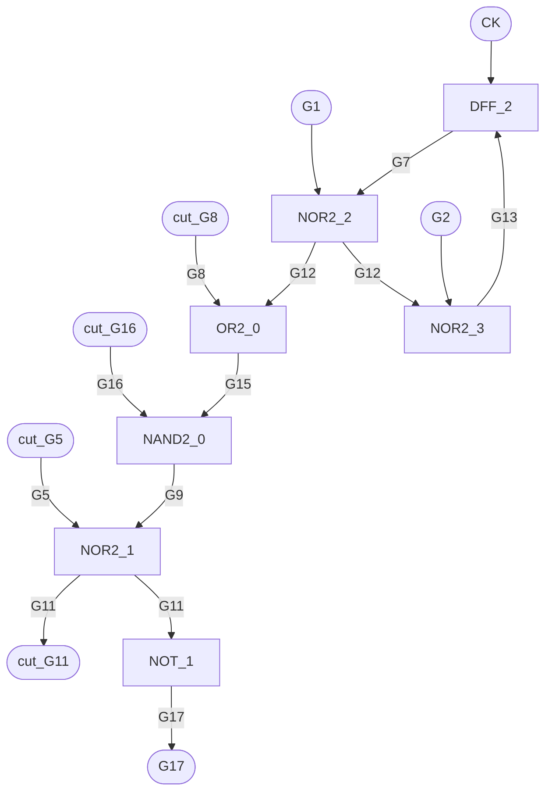

# s27 Partition B Circuit Diagram

```mermaid
graph TD
    %% Inputs
    CK([CK])
    G1([G1])
    cut_G16([cut_G16])
    G2([G2])
    cut_G5([cut_G5])
    cut_G8([cut_G8])

    %% Outputs
    cut_G11([cut_G11])
    G17([G17])

    %% Instances
    NOR2_2[NOR2_2]
    DFF_2[DFF_2]
    OR2_0[OR2_0]
    NOR2_1[NOR2_1]
    NOR2_3[NOR2_3]
    NAND2_0[NAND2_0]
    NOT_1[NOT_1]

    %% Connections
    %% Assignments (Input -> Internal)
    cut_G16 -->|G16| NAND2_0
    cut_G5 -->|G5| NOR2_1
    cut_G8 -->|G8| OR2_0

    %% Assignments (Internal -> Output)
    NOR2_1 -->|G11| cut_G11
    NOT_1 -->|G17| G17

    %% Instance Connections
    CK --> DFF_2
    
    G1 --> NOR2_2
    DFF_2 -->|G7| NOR2_2
    
    NOR2_2 -->|G12| OR2_0
    NOR2_2 -->|G12| NOR2_3
    
    G2 --> NOR2_3
    NOR2_3 -->|G13| DFF_2
    
    OR2_0 -->|G15| NAND2_0
    
    NAND2_0 -->|G9| NOR2_1
    
    NOR2_1 -->|G11| NOT_1
```
