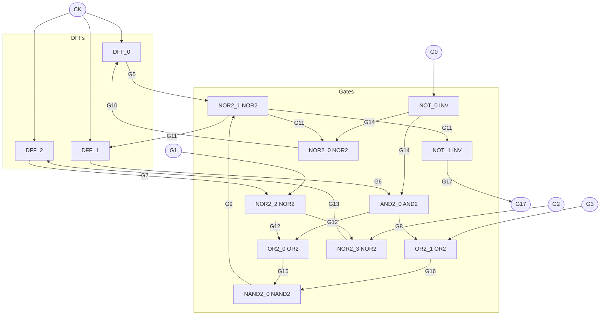

# s27 Gate-Level Circuit Diagram

This diagram represents the topology of the s27 sequential circuit.

```mermaid
graph TD
    %% Inputs
    CK([CK])
    G0([G0])
    G1([G1])
    G2([G2])
    G3([G3])

    %% Outputs
    G17([G17])

    %% Instances
    subgraph DFFs
        DFF_0[DFF_0]
        DFF_1[DFF_1]
        DFF_2[DFF_2]
    end

    subgraph Gates
        NOT_0[NOT_0 INV]
        NOT_1[NOT_1 INV]
        AND2_0[AND2_0 AND2]
        OR2_0[OR2_0 OR2]
        OR2_1[OR2_1 OR2]
        NAND2_0[NAND2_0 NAND2]
        NOR2_0[NOR2_0 NOR2]
        NOR2_1[NOR2_1 NOR2]
        NOR2_2[NOR2_2 NOR2]
        NOR2_3[NOR2_3 NOR2]
    end

    %% Connections
    CK --> DFF_0
    CK --> DFF_1
    CK --> DFF_2
    
    G0 --> NOT_0
    NOT_0 -- G14 --> AND2_0
    NOT_0 -- G14 --> NOR2_0
    
    G1 --> NOR2_2
    G2 --> NOR2_3
    G3 --> OR2_1
    
    DFF_0 -- G5 --> NOR2_1
    DFF_1 -- G6 --> AND2_0
    DFF_2 -- G7 --> NOR2_2
    
    AND2_0 -- G8 --> OR2_0
    AND2_0 -- G8 --> OR2_1
    
    OR2_1 -- G16 --> NAND2_0
    OR2_0 -- G15 --> NAND2_0
    
    NAND2_0 -- G9 --> NOR2_1
    
    NOR2_1 -- G11 --> DFF_1
    NOR2_1 -- G11 --> NOR2_0
    NOR2_1 -- G11 --> NOT_1
    
    NOR2_0 -- G10 --> DFF_0
    
    NOR2_2 -- G12 --> OR2_0
    NOR2_2 -- G12 --> NOR2_3
    
    NOR2_3 -- G13 --> DFF_2
    
    NOT_1 -- G17 --> G17
```
