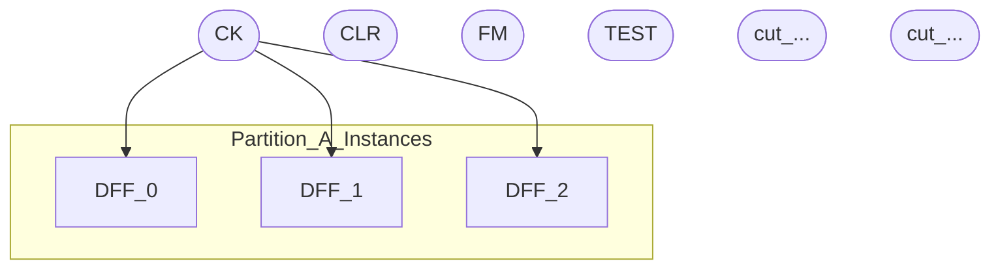

# s382 Partition A Circuit Diagram

```mermaid
graph TD
    %% Inputs (Subset)
    CK([CK])
    CLR([CLR])
    FM([FM])
    TEST([TEST])
    %% Cut Inputs (Examples)
    cut_sig1([cut_...])

    %% Outputs (Subset)
    %% Cut Outputs (Examples)
    cut_sig2([cut_...])

    %% Instances (Partition A)
    subgraph Partition_A_Instances
        %% Note: Partition A contains 91 instances.
        %% Listing all would make the diagram unreadable.
        %% Representative instances:
        DFF_0[DFF_0]
        DFF_1[DFF_1]
        DFF_2[DFF_2]
        %% ... and 88 more
    end

    %% Connections
    CK --> DFF_0
    CK --> DFF_1
    CK --> DFF_2
    
    %% Note: Detailed internal connectivity omitted for clarity due to size.
```
