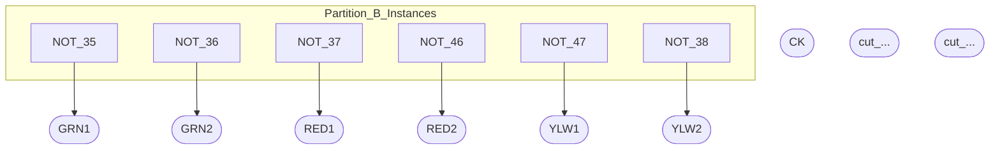

# s382 Partition B Circuit Diagram

```mermaid
graph TD
    %% Inputs (Subset)
    CK([CK])
    %% Cut Inputs (Examples)
    cut_sig3([cut_...])

    %% Outputs (Subset)
    GRN1([GRN1])
    GRN2([GRN2])
    RED1([RED1])
    RED2([RED2])
    YLW1([YLW1])
    YLW2([YLW2])
    %% Cut Outputs (Examples)
    cut_sig4([cut_...])

    %% Instances (Partition B)
    subgraph Partition_B_Instances
        %% Note: Partition B contains 86 instances.
        %% Listing all would make the diagram unreadable.
        %% Representative instances:
        NOT_35[NOT_35]
        NOT_36[NOT_36]
        NOT_37[NOT_37]
        NOT_46[NOT_46]
        NOT_47[NOT_47]
        NOT_38[NOT_38]
        %% ... and 80 more
    end

    %% Connections
    NOT_35 --> GRN1
    NOT_36 --> GRN2
    NOT_37 --> RED1
    NOT_46 --> RED2
    NOT_47 --> YLW1
    NOT_38 --> YLW2
    
    %% Note: Detailed internal connectivity omitted for clarity due to size.
```
