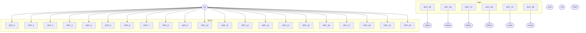

# s382 Circuit Diagram

```mermaid
graph TD
    %% Inputs
    CK([CK])
    CLR([CLR])
    FM([FM])
    TEST([TEST])

    %% Outputs
    GRN1([GRN1])
    GRN2([GRN2])
    RED1([RED1])
    RED2([RED2])
    YLW1([YLW1])
    YLW2([YLW2])

    %% Instances (Simplified View - Showing Key Components)
    subgraph DFFs
        DFF_0[DFF_0]
        DFF_1[DFF_1]
        DFF_2[DFF_2]
        DFF_3[DFF_3]
        DFF_4[DFF_4]
        DFF_5[DFF_5]
        DFF_6[DFF_6]
        DFF_7[DFF_7]
        DFF_8[DFF_8]
        DFF_9[DFF_9]
        DFF_10[DFF_10]
        DFF_11[DFF_11]
        DFF_12[DFF_12]
        DFF_13[DFF_13]
        DFF_14[DFF_14]
        DFF_15[DFF_15]
        DFF_16[DFF_16]
        DFF_17[DFF_17]
        DFF_18[DFF_18]
        DFF_19[DFF_19]
        DFF_20[DFF_20]
    end

    subgraph Logic
        NOT_35[NOT_35]
        NOT_36[NOT_36]
        NOT_37[NOT_37]
        NOT_46[NOT_46]
        NOT_47[NOT_47]
        NOT_38[NOT_38]
        %% Many other gates omitted for clarity
    end

    %% Connections (Key Paths)
    CK --> DFF_0
    CK --> DFF_1
    CK --> DFF_2
    CK --> DFF_3
    CK --> DFF_4
    CK --> DFF_5
    CK --> DFF_6
    CK --> DFF_7
    CK --> DFF_8
    CK --> DFF_9
    CK --> DFF_10
    CK --> DFF_11
    CK --> DFF_12
    CK --> DFF_13
    CK --> DFF_14
    CK --> DFF_15
    CK --> DFF_16
    CK --> DFF_17
    CK --> DFF_18
    CK --> DFF_19
    CK --> DFF_20

    NOT_35 --> GRN1
    NOT_36 --> GRN2
    NOT_37 --> RED1
    NOT_46 --> RED2
    NOT_47 --> YLW1
    NOT_38 --> YLW2

    %% Note: Full connectivity is too complex for a single diagram
```
